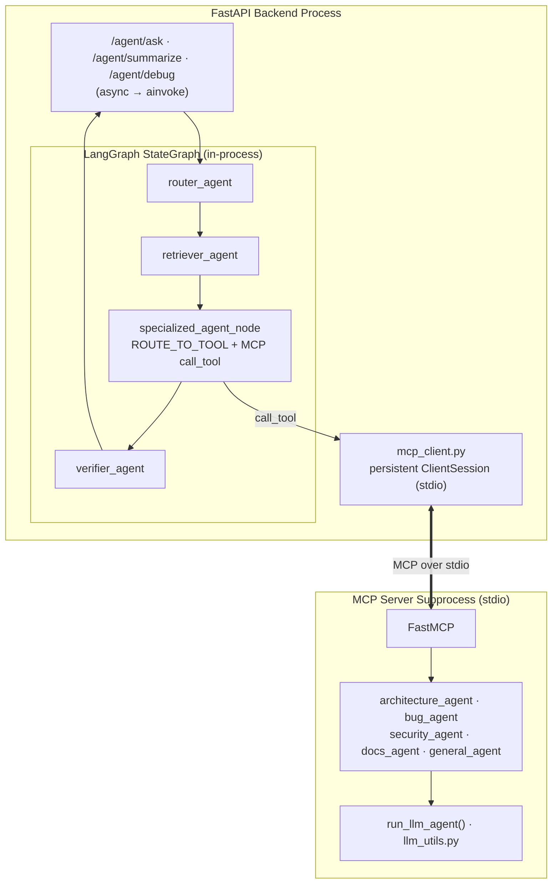

# CLAUDE.md

This file provides guidance to Claude Code (claude.ai/code) when working with code in this repository.

## What this is

RepoPilot AI is an AI engineering copilot for understanding, debugging, and onboarding into unfamiliar codebases. A user uploads a repository as a ZIP, the backend indexes it into a vector store, and a LangGraph multi-agent workflow answers natural-language questions grounded in the retrieved code.

## Commands

### Backend (from `backend/`)

```powershell
python -m venv venv
.\venv\scripts\activate.ps1
pip install -r requirements.txt
uvicorn app.main:app          # runs at http://127.0.0.1:8000, docs at /docs
uvicorn app.main:app --reload # dev mode with autoreload
```

Requires a `backend/.env` file (see `backend/.env.example`) with `OPENAI_API_KEY` at minimum.

There is no test suite yet (`backend/tests/` is empty) and no lint config for the backend.

### Frontend (from `frontend/`)

```powershell
npm install
npm run dev      # http://localhost:5173
npm run build
npm run lint      # oxlint
npm run preview
```

## Architecture

### Request flow

1. **Upload** (`POST /repos/upload` in [backend/app/api/repo_routes.py](backend/app/api/repo_routes.py)) — client uploads a ZIP, backend assigns a `repo_id` (uuid4), saves the ZIP to `backend/uploads/`, and safely extracts it to `backend/extracted_repos/{repo_id}/` (path-traversal-safe extraction, skips unreadable members).
2. **Scan** ([backend/app/services/repo_scanner.py](backend/app/services/repo_scanner.py)) — walks the extracted tree, filters out `IGNORED_DIRS`/binary/lockfile noise, and classifies files by extension via `LANGUAGE_MAP`.
3. **Chunk** ([backend/app/services/code_chunker.py](backend/app/services/code_chunker.py)) — splits each scanned file into overlapping line-based chunks (`CHUNK_SIZE_LINES=80`, `CHUNK_OVERLAP_LINES=15`), tagged with file path, language, and start/end line numbers.
4. **Index** (`POST /repos/{repo_id}/index` → [backend/app/services/vector_service.py](backend/app/services/vector_service.py)) — embeds each chunk with OpenAI `text-embedding-3-small` and upserts into a per-repo ChromaDB collection (`repo_{repo_id_with_underscores}`), persisted under `backend/vector_store/`. Embedding text includes file path/name/language/line-range metadata prepended to the chunk content, which improves retrieval on file-identity queries.
5. **Ask/Search** — `search_repository()` embeds the query and does a similarity search against the repo's collection, returning chunks with `similarity_distance` and 1000-char `content_preview`s.
6. **Answer** — two parallel paths exist:
   - The legacy single-shot path: `POST /repos/{repo_id}/ask` → [backend/app/services/answer_service.py](backend/app/services/answer_service.py), one retrieval + one `gpt-4o-mini` completion, source-grounded.
   - The primary multi-agent path: `POST /agent/ask`, `/agent/summarize`, `/agent/debug` in [backend/app/main.py](backend/app/main.py), which invoke the LangGraph workflow.

### LangGraph multi-agent workflow (with MCP)

Defined in [backend/app/agents/graph.py](backend/app/agents/graph.py) and [backend/app/agents/nodes.py](backend/app/agents/nodes.py), sharing state via `RepoPilotState` ([backend/app/agents/state.py](backend/app/agents/state.py)) — a `TypedDict` with `repo_id`, `question`, `route`, `contexts`, `answer`, `verified`, `verifier_notes`, `steps`. Every node appends a human-readable entry to `steps`, which is surfaced to the frontend as the agent's execution trace.

**The orchestrator talks to the 5 specialized agents over MCP (Model Context Protocol), not in-process.** `router_agent`, `retriever_agent`, and `verifier_agent` are in-process LangGraph nodes; the 5 specialized agents live in a separate MCP server subprocess ([backend/app/mcp_server/server.py](backend/app/mcp_server/server.py), a `FastMCP` instance exposing each as an `@mcp.tool()`) spawned once at FastAPI startup via `lifespan` and reused across requests.

Graph shape (linear — routing happens inside `specialized_agent_node`, not via conditional edges): `router_agent → retriever_agent → specialized_agent_node → verifier_agent`.



- **router_agent** (in-process): LLM call (`gpt-4.1-mini`) classifies the question into one of `architecture | bug | security | docs | general_rag`. Falls back to `general_rag` on any exception or unrecognized output.
- **retriever_agent** (in-process): calls `search_repository()` with a route-dependent `top_k` (architecture/security/docs=8, bug=6, general_rag=5) — more context for structural questions, less for narrow bug lookups.
- **specialized_agent_node** (in-process, `async`): maps `route → tool name` via `ROUTE_TO_TOOL` (note `general_rag → general_agent`), then `await session.call_tool(...)` on the persistent MCP session from [backend/app/agents/mcp_client.py](backend/app/agents/mcp_client.py). Wrapped in one try/except: transport failures and tool-side errors (`CallToolResult.isError`) both funnel into a graceful "unavailable" answer + a `"<tool> agent (via MCP) failed: ..."` step rather than a 500.
- **specialized agent tools** (MCP subprocess): each has a fixed system prompt enforcing a specific Markdown response structure (e.g. architecture emits `# Architecture Overview` with 6 numbered sections). All call `run_llm_agent()` (shared helper in [backend/app/agents/llm_utils.py](backend/app/agents/llm_utils.py)) with `gpt-4.1-mini`. Prompts live only in `server.py`.
- **verifier_agent** (in-process): a second LLM pass checking whether the answer is grounded in the retrieved context, returning `VERIFIED: yes/no` plus notes; parsed into `verified: bool` and `verifier_notes: str`.

Because `specialized_agent_node` is `async`, the graph must be driven with `.ainvoke()` (not `.invoke()`), so the three `/agent/*` endpoints in `main.py` are `async def`. The MCP client forwards `env=os.environ.copy()` to the subprocess so it inherits `OPENAI_API_KEY`; both `main.py` and `server.py` call `load_dotenv(override=True)` so `backend/.env` wins over any stale OS-level `OPENAI_API_KEY`.

`/agent/summarize` and `/agent/debug` reuse the same graph by pre-seeding `question` (and for summarize, `route="architecture"`) with a structured prompt template before invoking it — they are not separate graphs.

When adding a new specialized agent: add the `@mcp.tool()` function (and its system prompt) in `mcp_server/server.py`, add the route name to `ROUTE_TO_TOOL` in `nodes.py`, and add the route to `router_agent`'s `allowed_routes` set and its system prompt's route list. The graph itself and `specialized_agent_node` need no changes — dispatch is a dict lookup, not a graph edge.

### Storage layout (backend, all gitignored)

- `backend/uploads/{repo_id}_{original_filename}.zip` — raw uploads
- `backend/extracted_repos/{repo_id}/` — extracted source tree
- `backend/vector_store/` — ChromaDB persistent store, one collection per repo
- Deleting a repo (`DELETE /repos/{repo_id}`) removes all three.

### Frontend

Single-page dashboard in [frontend/src/App.jsx](frontend/src/App.jsx) (~600 lines, no router/state library — plain React state) driving the flow: upload → scan → index → ask/summarize/debug. All backend calls go through [frontend/src/api.js](frontend/src/api.js), which hardcodes `API_BASE_URL = http://127.0.0.1:8000`. Answers are rendered with `react-markdown`; the UI also displays `sources` (file/line citations) and `steps` (agent trace) returned by the `/agent/*` endpoints.

### Config

[backend/app/core/config.py](backend/app/core/config.py) uses `pydantic_settings.BaseSettings` reading `backend/.env` (`OPENAI_API_KEY` required; `DATABASE_URL` and `ENVIRONMENT` have defaults but are not currently used elsewhere in the code — no database is actually wired up despite `DATABASE_URL`/`psycopg2`/`SQLAlchemy`/`alembic` being present in `requirements.txt`).
