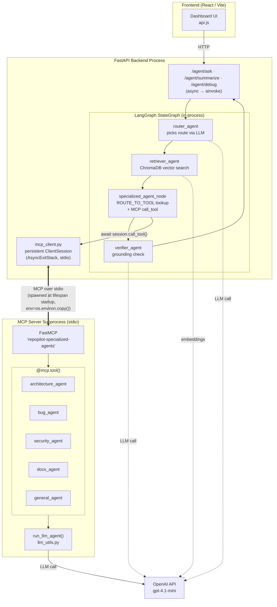
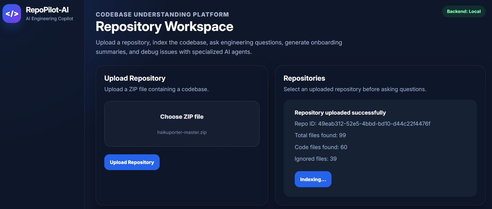
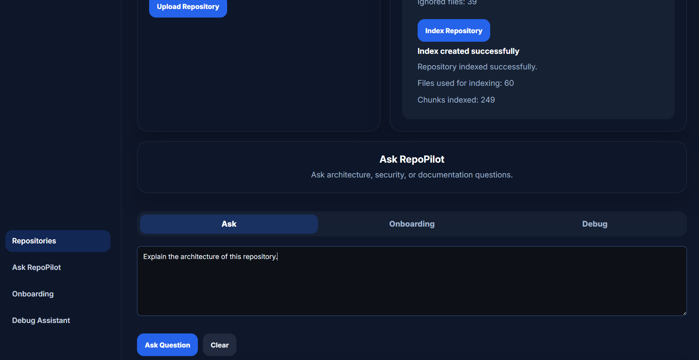
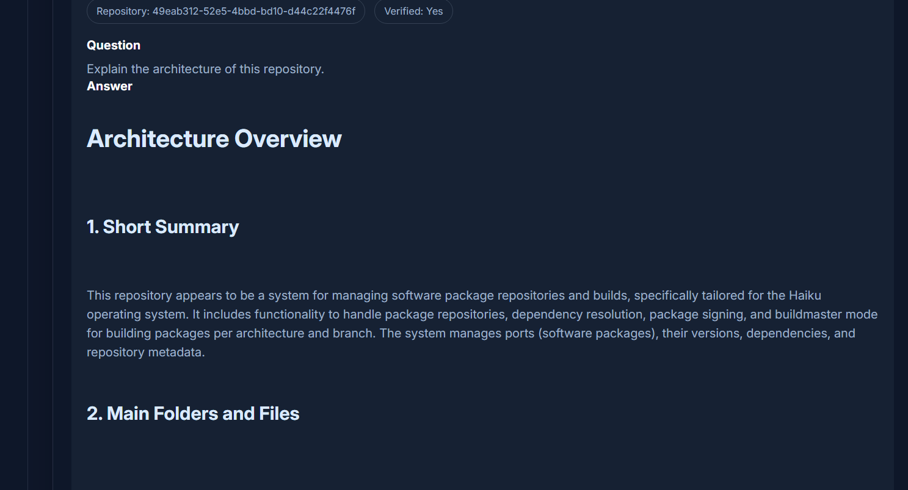
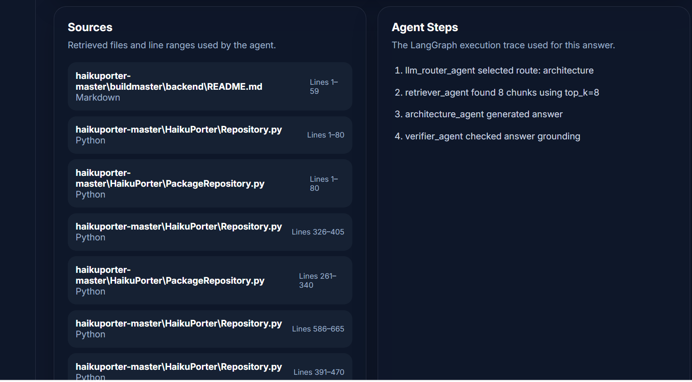
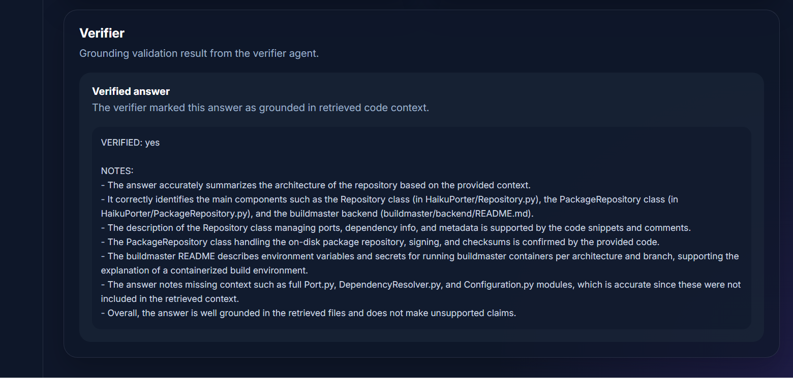

# RepoPilot AI

RepoPilot AI is an AI engineering copilot for understanding, debugging, and onboarding into unfamiliar codebases.

The system allows users to upload a repository as a ZIP file, index the codebase, and ask natural-language engineering questions. It uses retrieval-augmented generation and a multi-agent workflow to route questions to specialized agents for architecture explanation, onboarding summaries, bug diagnosis, and grounded answer verification.

## Features

- Upload a repository ZIP file from the frontend
- Automatically scan and process code files
- Chunk and index repository content for retrieval
- Ask architecture and codebase questions
- Generate developer onboarding summaries
- Debug repository-specific issues
- Retrieve source file references and line ranges
- Show agent execution steps
- Verify answers against retrieved code context

## Tech Stack

### Backend
- FastAPI
- Python
- OpenAI API
- Local vector store (ChromaDB)
- LangGraph multi-agent workflow for routing, retrieval, answering, debugging, summarization, and verification
- MCP (Model Context Protocol) — the orchestrator communicates with the specialized agents as MCP tools over stdio

### Frontend
- React
- Vite
- JavaScript
- React Markdown
- Custom CSS dashboard UI

## Project Structure

```txt
RepoPilot-AI/
├── backend/
│   ├── app/
│   │   ├── agents/
│   │   ├── api/
│   │   ├── core/
│   │   ├── schemas/
│   │   └── services/
│   ├── requirements.txt
│   └── .env.example
├── frontend/
│   ├── src/
│   │   ├── App.jsx
│   │   ├── App.css
│   │   └── api.js
│   ├── package.json
│   └── vite.config.js
└── README.md
```

## Architecture

The orchestrator (router) communicates with the five specialized agents through **MCP (Model Context Protocol)**. The router, retriever, and verifier run as in-process LangGraph nodes; the specialized agents run in a separate MCP server subprocess and are invoked as MCP tools over stdio. The subprocess is spawned once at FastAPI startup (via the `lifespan` handler) and reused across requests.



## Setup Instructions

### Backend Setup

```powershell
cd backend
python -m venv venv
.\venv\scripts\activate.ps1
pip install -r requirements.txt
```

Create a `.env` file inside the `backend/` folder:

```env
OPENAI_API_KEY=your_openai_api_key_here
```

Run the backend:

```powershell
uvicorn app.main:app
```

The backend will run at:

```txt
http://127.0.0.1:8000
```

API documentation is available at:

```txt
http://127.0.0.1:8000/docs
```

### Frontend Setup

Open a new terminal:

```powershell
cd frontend
npm install
npm run dev
```

The frontend will run at:

```txt
http://localhost:5173
```

## Usage Flow

1. Start the backend server.
2. Start the frontend development server.
3. Upload a repository ZIP file.
4. Index the uploaded repository.
5. Ask architecture or codebase questions.
6. Generate onboarding summaries.
7. Use the debug assistant for repository-specific issues.
8. Review retrieved sources, agent steps, and verifier notes.

## Screenshots

### Repository Dashboard



### Indexed Repository



### Agent Answer



### Sources and Agent Steps



### Verifier 

